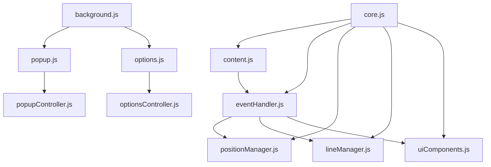

# Google Map 羅盤 Chrome 擴充功能

這是一個專為 Google Maps 設計的 Chrome 擴充功能，可在地圖上方顯示一個可調整的羅盤工具，協助使用者進行風水相關的規劃與分析。

## 功能特色

### 基本操作
- 按下 `V` 鍵顯示/隱藏羅盤
- 使用滑鼠拖曳移動羅盤位置
- 透過滑鼠滾輪調整羅盤大小

### 羅盤控制
- `Q`/`E`: 向左/右旋轉羅盤 5 度
- `W`/`R`: 向左/右旋轉羅盤 1 度
- `O`/`P`: 增加/降低羅盤透明度

### 輔助線功能
- `A`/`D`: 向左/右旋轉藍色十字線 5 度
- `S`/`F`: 向左/右旋轉藍色十字線 1 度
- 按住 `Ctrl` + 滑鼠拖曳可繪製輔助線
- `C`: 清除所有輔助線

### 精確定位
- 使用方向鍵（↑、↓、←、→）可微調羅盤位置

## 使用畫面

### 主要介面
*羅盤在 Google Maps 上的疊加顯示*<br>


### 操作功能
*使用鍵盤進行羅盤控制*<br>


### 自定義羅盤
*可自定圖檔（如羅盤或玄空盤）使用*<br>


## 安裝方式

1. 下載此專案的所有檔案
2. 開啟 Chrome 瀏覽器，進入「擴充功能管理」頁面
3. 開啟「開發人員模式」
4. 點選「載入未封裝項目」
5. 選擇此專案的資料夾

## 除錯模式

此擴充功能內建除錯模式，可在 Chrome 開發者工具的主控台中查看詳細的操作日誌。

## 注意事項

- 擴充功能需要在 Google Maps 網頁上使用
- 部分快速鍵可能會與其他擴充功能或網頁快速鍵衝突
- 在輸入文字時，快速鍵會自動停用（除了 `V` 鍵）

## 技術說明

- 使用原生 JavaScript 開發
- 透過 Chrome Extension API 實現功能
- 支援本地設定儲存
- 使用 DOM 操作實現視覺效果

## 程式架構說明

### 核心模組
| 檔案 | 說明 | 主要功能 |
|------|------|----------|
| core.js | 核心功能模組 | - 除錯功能管理<br>- 狀態管理<br>- 初始化控制 |
| eventHandler.js | 事件處理模組 | - 鍵盤事件處理<br>- 滑鼠事件處理<br>- 手勢控制 |
| content.js | 內容腳本模組 | - DOM 元素注入<br>- 擴充功能初始化<br>- 元件生命週期管理 |

### 功能模組
| 檔案 | 說明 | 主要功能 |
|------|------|----------|
| modules/lineManager.js | 線條管理器 | - 輔助線繪製<br>- 線條樣式控制<br>- 線條狀態管理 |
| modules/positionManager.js | 位置管理器 | - 羅盤位置控制<br>- 縮放功能<br>- 視窗大小調整處理 |
| modules/uiComponents.js | UI 元件建構器 | - 羅盤元件建立<br>- 十字線元件建立<br>- 介面元素管理 |

### 使用者介面
| 檔案 | 說明 | 主要功能 |
|------|------|----------|
| popup.html/js | 彈出視窗介面 | - 快速控制面板<br>- 功能按鈕<br>- 狀態顯示 |
| options.html/js | 選項設定介面 | - 羅盤圖片設定<br>- 除錯模式控制<br>- 設定儲存 |
| modules/popupController.js | 彈出視窗控制器 | - 按鈕事件處理<br>- 訊息傳遞<br>- 狀態同步 |
| modules/optionsController.js | 選項控制器 | - 設定表單處理<br>- 圖片上傳<br>- 設定儲存 |

### 背景處理
| 檔案 | 說明 | 主要功能 |
|------|------|----------|
| background.js | 背景服務工作者 | - 擴充功能狀態管理<br>- 分頁間通訊<br>- 圖示狀態控制 |
| manifest.json | 擴充功能設定檔 | - 權限宣告<br>- 資源配置<br>- 腳本載入順序 |

### 檔案結構
```
GoogleMapLuoPan/
├── modules/             # 功能模組目錄
│   ├── core.js         # 核心功能
│   ├── lineManager.js  # 線條管理
│   ├── positionManager.js # 位置管理
│   ├── uiComponents.js # UI 元件
│   ├── popupController.js # 彈出視窗控制
│   └── optionsController.js # 選項控制
├── images/             # 圖片資源目錄
├── manifest.json       # 擴充功能設定
├── background.js       # 背景服務
├── content.js         # 內容腳本
├── eventHandler.js    # 事件處理
├── popup.html/js      # 彈出視窗介面
├── options.html/js    # 選項設定介面
└── README.md          # 文件說明
```

### 模組相依關係


### 設計模式應用
- **單例模式**：用於核心模組和管理器類別
- **觀察者模式**：用於事件處理和狀態更新
- **建構者模式**：用於 UI 元件的建立
- **命令模式**：用於處理使用者輸入和控制
- **策略模式**：用於不同的羅盤操作模式

### 程式碼品質管理
- 模組化設計
- 依賴性注入
- 錯誤處理機制
- 除錯訊息系統
- 註解完整性

## 授權說明

此專案採用 MIT 授權條款。